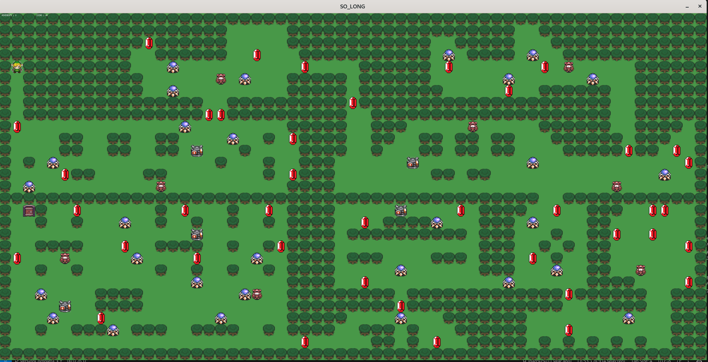

<h1 align="center">School 42 so_long</h1>

This repository contains my implementation of the so_long project from the 42 cursus. The goal is to create a small 2D game using the MiniLibX graphics library.

<h2 align="center">
    <a href="#about">About</a>
    <span> · </span>
    <a href="#structure">Structure</a>
    <span> · </span>
<a href="#enemies">Enemies</a>
    <span> · </span>
    <a href="#requirements">Requirements</a>
    <span> · </span>
    <a href="#instructions">Instructions</a>
</h2>

## About

**so_long** is a project that introduces the basics of graphical programming. The task is to build a simple game where a player navigates a map, collects items, and reaches an exit. The game must be built using the MiniLibX, a simple X-Window programming API provided by 42.

The core gameplay loop involves:

* Controlling a player character on a 2D map.

* Collecting all the collectibles ('C') scattered across the map.

* Reaching the exit ('E') only after all collectibles have been gathered.

* Avoiding enemies that can end the game.

## Structure

The project is built around several key components that work together to create the game experience.
#### 1. Map Parsing and Validation

The game starts by reading a map file with a .ber extension.

**Validation:** Before launching the game, the map is rigorously checked to ensure it's valid. This includes:

* Verifying it's a closed rectangle surrounded by walls ('1').

* Ensuring it contains exactly one player ('P'), one exit ('E'), and at least one collectible ('C').

* Using a flood-fill algorithm to confirm that there is a valid path from the player's starting position to all collectibles and the exit.

#### 2. Graphics and Rendering

The MiniLibX library is used to open a window and render the game.

Sprites: All game elements (walls, floor, player, collectibles, etc.) are represented by .xpm image files (sprites). These are loaded at the start of the game.

Rendering Loop: The game runs in a loop where the map is continuously re-drawn. The mlx_loop_hook function is used to handle animations and enemy movements, while mlx_hook listens for keyboard and window events.

#### 3. Player and Input

The player can move up, down, left, or right using the W, A, S, D or arrow keys.

The number of moves is displayed on the screen and printed to the terminal when the game ends.

The game can be closed by pressing the ESC key or clicking the window's close button.

## Enemies

This version of so_long includes one enemy type to make the game more challenging (you should check the the other branch in this repository).

    Basic Enemy (F): Patrols a set path.


## Requirements

To compile and run this project, you will need:

* A C compiler, such as gcc.

* The make utility.

* The MiniLibX library (included in the repository).

* The necessary X11 development libraries (-lXext -lX11).

## Instructions
#### 1. Compile the Project

To compile the game, clone the repository and run:

```$ make```
The Makefile will automatically compile the included libft and MiniLibX libraries.

If you want to acces the bonus version (you should check the the other branch in this repository):

```$ make bonus```

#### 2. Clean Files

To remove the object files (.o):

```$ make clean```

To remove object files and the executable:

```$ make fclean```

To clean and recompile everything:

```$ make re```

#### 3. How to Run

Run the game with a map file as an argument:

```$ ./so_long maps/basico.ber```

If you're interested in seeing the full version feel free to check out the full_version branch in this repository!


